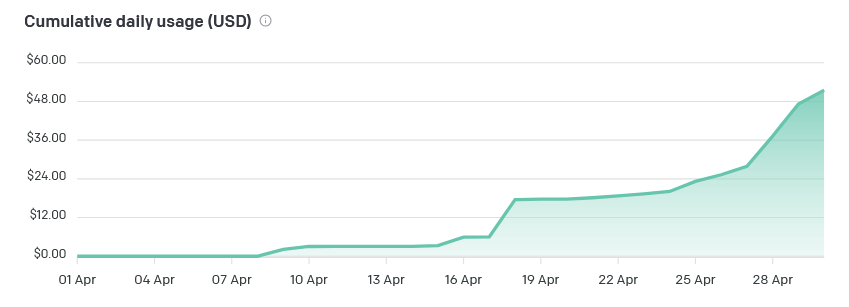
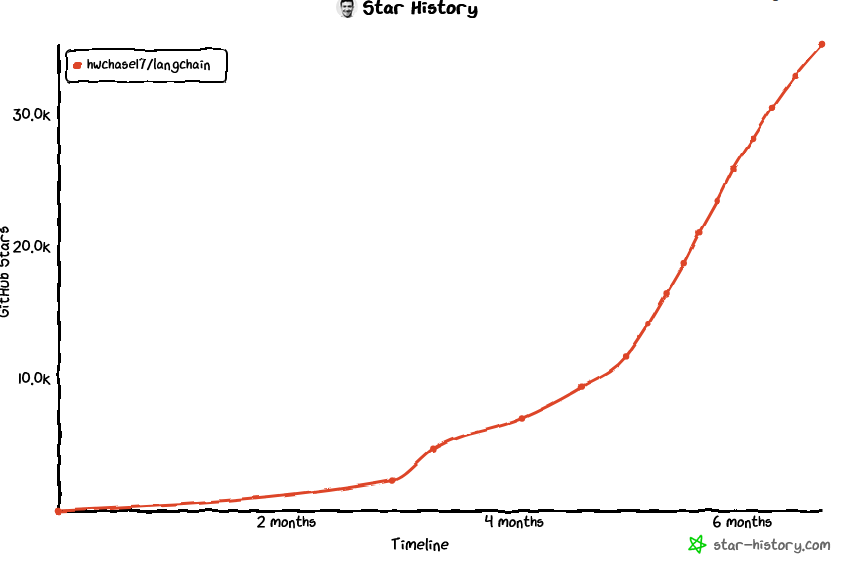

Recently I have been spending a lot of my free time with ChatGPT as well as the OpenAI
models (`gpt-3.5`, `gpt-3.5-turbo-0301` & `text-davinci-003`). Admittedly it has been my main reason to start this blog,
because I have grown so eager about developing local chatbots trained on my data.

At this point, I have also come way too far in token spending to keep quiet.



#### How I have been experiencing ChatGPT so far

Like most people working in tech, I have been using ChatGPT 3 & 4 quite heavily ever since it was released. It has been
a huge in terms of being a force multiplier, and has also greatly reduced my reliance on Google and Stackoverflow. But
after all these months, my sense of wonder and excitement has been dwindling. Yes it's a great tool, the hype is real,
but I am also not as amazed as most people.

#### Rather than ChatGPT I want a Jarvis like assistant

I think what we all really want, is not some browser window, where a prompt is a hit or miss, but rather an interactive
agent bearing similarities to **`Jarvis`**. Someone that answers your questions without prompting, doesn't forget what
you
asked him a few hours or days ago, and keeps track of tasks and goals. So that's what I started out to code.

**A few requirements that I had for my personal Jarvis:**

1. `Jarvis` must be able to **retrieve** current data from the internet (`Google` & `Wiki`).
2. `Jarvis` must **remember** past conversations (beyond token limit).
3. `Jarvis` must **learn** from past conversations (beyond token limit)
4. `Jarvis` must **initiate** conversations with me from time to time.

Being honest, these weren't my initial requirements, but after two weekends of playing around with the ChatGPT API in
plain Python, I slowly started figuring out what I wanted. I also found out about Langchain, which is a fairly new and
popular framework for building applications with LL M's. And apparently everyone is using it!



**Steps to customization**

It all started with `ChatOpenAI(temperature=0)` which under the hood initialized the OpenAI model `gpt-3.5-turbo`, not
quite as good as `gpt-4`, but since I did not have access to `gpt-4` yet ... good enough!

> **Note**: While I will go into the details (code snippets & considerations) of actually customizing such an 
> assistant into another blog post, I will use this post on a general overview of the actions which I have taken 
> and the limitations I learned.

Contrasting my requirements against the available options with Langchain, I slowly started to see what I had to build.
Langchain comes with quite a few batteries included, and I was about to use most of those.

1. **Tools:**

   Langchain comes with a large set of tools, which can either be used out of the box, or can be customized. What I
   learned here is that customization always beats using any of these tools out of the box. Basically, by customizing
   any tool, you can tell the LLM when, where and how many times to use it (min or max), rather than relying on
   defaults.

   **A cutomized tool looks like
   this ([more info](https://python.langchain.com/en/latest/modules/agents/tools/custom_tools.html)):**

    ```python
    search = ToolClass()
    
    tools = [
        Tool.from_function(
            func=search.run,
            name = "Useful Search to use for doing Y",
            description="useful for when searching for Y but not X"
        ),
    ]
    ```

   **Which tools I decided to include:**

    - **DuckDuckGo over Google**:
        - Initially I went with the SerpAPI through Google, but quickly realized that a huge drawback would be the cost.
          There would be 100 free API calls I would be able to max out, but having to pay more than 10$ and being having
          my credit card tied to some random experiment, didn't really sound so convincing to me. DuckDuckGo API calls
          are free instead, so I went with that.
    - **[LLM-Math](https://python.langchain.com/en/latest/modules/chains/examples/llm_math.html):**
        - Included with Langchain, for doing basic calculations any result (like a Google result). For example,
          retrieving today's lottery numbers (DuckDuckGo) and having the result be multiplied by 10. Which is a great
          thing for things like exchange rates.
    - **[Wikipedia](https://python.langchain.com/en/latest/modules/agents/tools/examples/wikipedia.html)**
        - Simple Wikipedia Retrieval. For example, what we can do here is bypass the need for a search query, and
          instead go to WikiPedia directly. We could ask the LLM to list 10 similarities between queen Cleopatra and
          Obama. Where without wikipedia we would likely some results stacked on top of our DuckDuckGo search, but with
          Wikipedia we will end up comparing the results between two actual WikiPedia pages.
      
### --- To be continued in Part 2:

- **Giving the LLM a large amount of my biases and preferences.**
   - Redis Vector storage
   - OpenAI Embeddings
- **Short & Long Term memory and context management.**
    - Summarization
    - Redis
- Automation
  - [FastAPI](https://fastapi.tiangolo.com/)
  - [n8n](https://n8n.io/)
 
### --- To be continued in Part 3:

- Moving from GPT-3.5 Turbo to GPT-4
- Moving from GPT-4 to an Open Source model