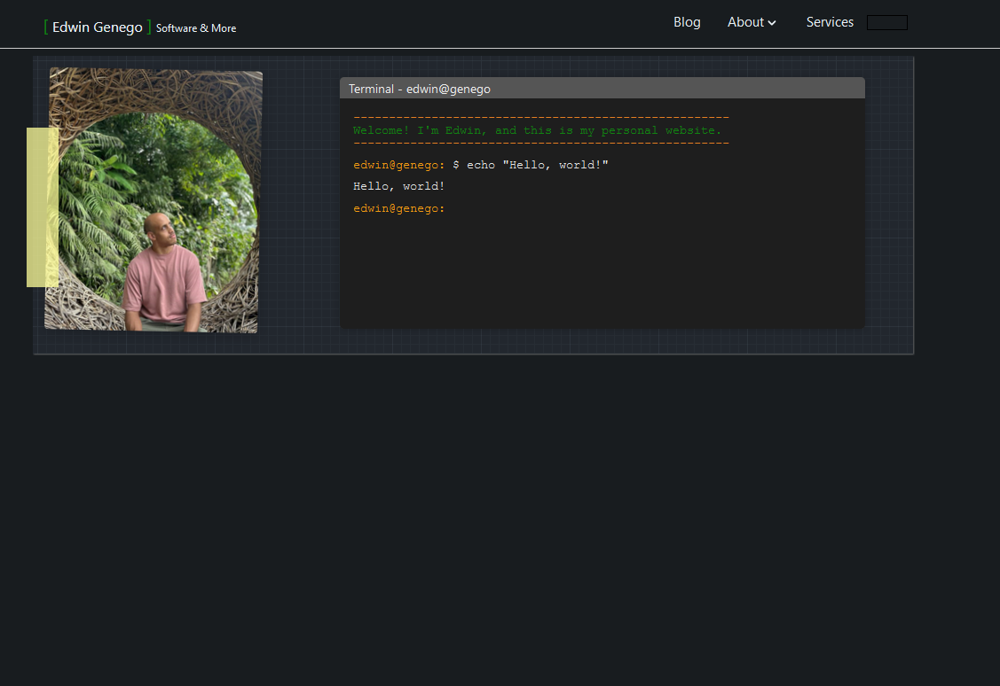

While I am slowly designing my new website, it is starting to dawn on me why all previous attempts have failed. From
the numerous attempts over more than a decade. I always set out to create something which was perfect, polished and
finished. To create something as awesome as I have seen in many other places on the internet, other experts and
professionals who show-case themselves in such a way that it induces envy. Yet, due to necessity, I now ended up with
3 separate properties (Gitbook, Gatsby, LinkedIn), which I have been polishing in separation over years.

## Iteration

Arriving at this point of re-creating these properties, I am reflecting of all the scrum sprints I have done, and where
the key to success was not to get it right in one go, but rather to get it right through iteration. I am seeing that my
previous approaches all failed due to the fixation of getting it perfect. Just to give an example, this is my Gitbook
website at edwin.genego.io today.

And this here is what it was 300+ commits or iterations ago.

Each individual page also went through a huge upgrade, but I am not going to paste all the screenshots here. Maybe to an
outsider, it doesn't look that different. However, the way it looks today, is much closer to what I thought of
"perfection" for my website, when I started out. Had I fixated myself once more on getting it right, and the first
time, I probably would still be frozen in the state of not having a web-property at all.

## Current state of the redesign

Again, I am currently not happy. Every evening, I am spending an hour on the website, and bit by bit, things are
improving. Then I remind myself, that things look like crap, I take a step back and revise. However, I always continue
moving forwards. Currently, the blog is fully set up. I need to introduce the tagging and series system, as well as
refining the page/article posting system as well.

> old me: (╯°□°)╯︵ ┻━┻
> 
> new me: ┏━┓┏━┓┏━┓ ︵ /(^.^/)

Once again, just as with Gitbook, I have a very "rough" idea of where I want to end up. But I am unable to see it.
Hence, I am a creator ... not a designer. Regardless, I think I can probably get the website online and running within a
week or two, and then can retire this blog, and edwin.genego.io. I also think, I will move to a `dev` domain. Something
which intersects between playfulness and professionalism, without using my first and last name in the domain. 
