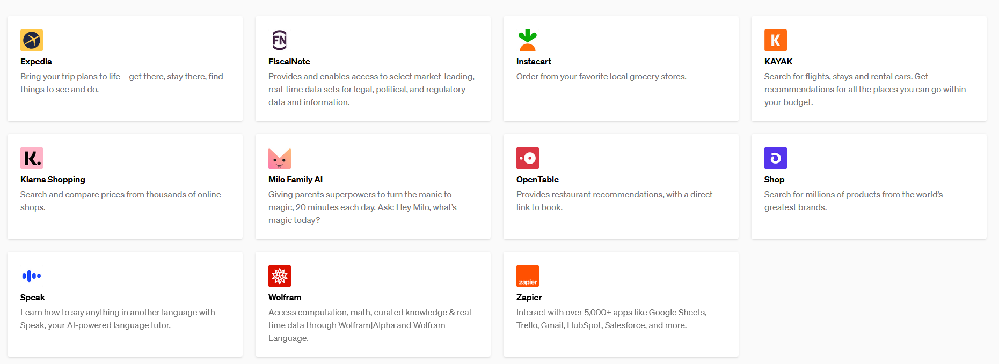
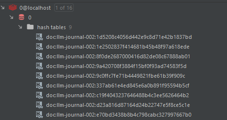
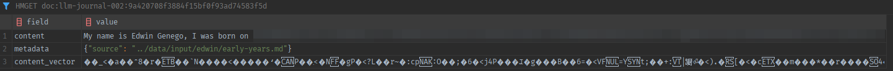
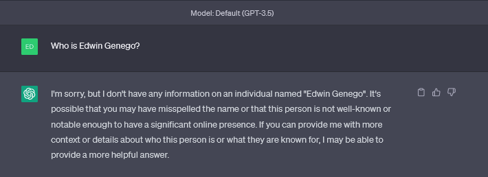
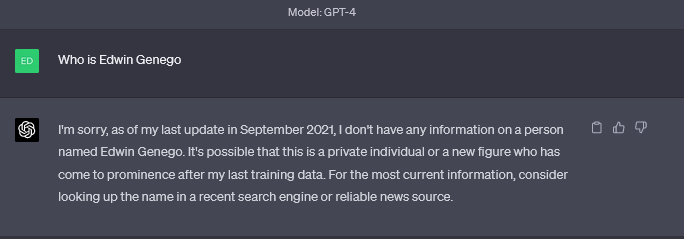
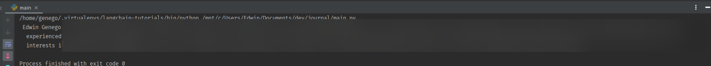

<!-- TOC -->
  * [Tools](#tools)
    * [ChatGPT Plugins](#chatgpt-plugins)
    * [Drawbacks of using tools vs OneShot or FewShot Prompts](#drawbacks-of-using-tools-vs-oneshot-or-fewshot-prompts)
  * [Extending ChatGPT 3.5 (& 4) with my own information](#extending-chatgpt-35--4-with-my-own-information)
    * [Starting with 10 documents.](#starting-with-10-documents)
      * [Chunking & splitting these documents](#chunking--splitting-these-documents)
    * [Creating Embeddings](#creating-embeddings)
    * [Storing these in Embeddings as Vectors](#storing-these-in-embeddings-as-vectors)
    * [Redis as vector store](#redis-as-vector-store)
  * [Asking ChatGPT-3.5 and 4 answers based on the stored vectors](#asking-chatgpt-35-and-4-answers-based-on-the-stored-vectors)
    * [Chatting with my own data (or any document really)](#chatting-with-my-own-data-or-any-document-really)
    * [--- To be continued in Part 3:](#----to-be-continued-in-part-3)
    * [--- To be continued:](#----to-be-continued)
<!-- TOC -->

## Tools

Continuing from where I left off in my last post, where I explained various tools, I wanted to into a little more detail
about why, how and when to use tools. In general a tool is no different from a human (like me!) deciding to use Google
over DuckDuckGo, Wikipedia over Google, or a calculator (llm-math) over Wikipedia. But instead of this being a human
decision, with an LLM, this decision is now being left up to the AI. The way it decides is through the English language;
so lets say we give it a question of: `Where does John Doe live`. With the following prompt:

> You are a helpful AI assistant, and you are answering a human. If you don't know the answer to a question, you simply
> say you don't know. Human's question: {question}

The LLM won't be able to derive this from its knowledge, so it generally would respond with `I don't know`. However,
with langchain, with the usage of tools, we can inform the LLM, that it can call on certain tools, to try to answer
the `I don't know` element. For example the prompt would now be:

> You are a helpful AI assistant, and you are answering a human. If you don't know the answer to a question, you simply
> you can try to call on the following tools: `Search`, `Math`, `Wiki`. If you cannot find the answer through these,
> simply respond with `I don't know`

The LLM would then have context from the Tool's description:

```python
Tool.from_function(
    func=private_spy.tool.run,
    name="Useful for searching information about a person.",
    description="Given a name, searches for as much information possible on a given person."
),
```

It would first iterate over all the tools, and from deduct that a tool in its arsenal is something which can be used or
not. If there is an available tool, it will attempt to use it, we can also adjust on how many times it will use a tool,
or how many tools it would use at max. If it does not find a suitable tool, or the correct answer is not returned, the
answer will still be `I don't know`.

### ChatGPT Plugins



A tool in this context is very similar to what a ChatGPT plugin is right now (to which, despite having Pro I don't
have access to yet!). The difference being, that with Langchain (or base Python), customizing the API in such a way
creates an unlimited amount of options.

### Drawbacks of using tools vs OneShot or FewShot Prompts

1. Using tools, means that your response will take much longer.
2. To verify that the answer is correct, you would need to consume more tokens (longer + more expensive)
3. Even when chaining multiple tools and prompts, using a tool may still not answer your question, while it is still
   going to consume a lot of tokens and take a lot longer to retrieve and answer.

## Extending ChatGPT 3.5 (& 4) with my own information

Having tools by itself is already great, but we won't stop there. Firstly, what I want for my Jarvis is to hold some of
my biases and preferences, so that it can help to break through those. In simple terms this means vectorizing
documents (notes, my bio and journal entries) and storing these vectors in embeddings, so that an LLM can retrieve them.
At least, that is what we can do for now, in the future (when it becomes available), a hybrid approach of fine-tuning +
vectorizing & embedding, would also be interesting to try out.

### Starting with 10 documents.

So lets say we have 10 documents, for the purpose of the experiment, lets say we have `Markdown`, `Text` and `PDFs`,
which are all multipage and can have anywhere from 1-10 pages. Our goal here is to somehow store the contents of these
documents, so that an LLM can retrieve these. The **somehow** is a 2-step approach:

1. Split these documents into smaller pieces (100/500/1000 or even more) words per chunk.
2. Store the mathematical representation (embeddings) in a database, so that an LLM can approximate whether any of the
   smaller pieces of information are relevant for answering a question.

#### Chunking & splitting these documents

First vectorizing these documents into chunks is rather easy (or at least after doing it 100 times). I created a small
script which goes through a given folder, chunks the information and then stores the result in a python `list()`

```python

for dir_path, _, filenames in os.walk(self.data_source_folder):
    for filename in filenames:
        print(f"Working on: {filename}")
        if filename.endswith((".md", ".rst")):
            file_path = os.path.join(dir_path, filename)
            loader = UnstructuredMarkdownLoader(file_path)
            text = loader.load()
            text_splitter = RecursiveCharacterTextSplitter(
                chunk_size=2000, chunk_overlap=200
            )
            texts = text_splitter.split_documents(documents=text)
            documents.extend(texts)
        if filename.endswith((".pdf",)):
            file_path = os.path.join(dir_path, filename)
            loader = PyPDFLoader(file_path)
            pages = loader.load_and_split(
                text_splitter=RecursiveCharacterTextSplitter(
                    chunk_size=2000, chunk_overlap=200
                )
            )
            documents.extend(pages)
    )
```

### Creating Embeddings

```python

def create_embeddings(self) -> Union[OpenAIEmbeddings, JinaEmbeddings]:
    if self.embedding == "OpenAI":
        return OpenAIEmbeddings(openai_api_key=OPENAI_API_KEY)
```

### Storing these in Embeddings as Vectors

And then stores these embeddings in Redis (which is one of many options)

```python

def create_vectors(self, documents, embeddings):
    from langchain.vectorstores.redis import Redis

    return Redis.from_documents(
        documents,
        embeddings,
        redis_url=REDIS_URL,
        index_name=DATA_STORAGE_INDEX_NAME,
    )
```

### Redis as vector store

I went with Redis, since for my purposes this seems the fast, and also better maintainable. At any point I can easily
clear the stored vectors and start over. Initially I was using Chroma vectors, which means that the information is
stored in my file storage, but I found that this was a little slower (10-20%), and deleting this to start over would
take longer.

This is what it looks like in Redis:

| All Vectors             | Particular Vector       |
|-------------------------|-------------------------|
|  |  |

Which represents some pieces of my Journal & Bio, now stored as embeddings.

## Asking ChatGPT-3.5 and 4 answers based on the stored vectors

This is where the magic starts, lets say we first head to the ChatGPT web interface, we ask some information about me.

| GPT-3.5                 | GPT-4                   |
|-------------------------|-------------------------|
|  |  |

Of course! But now lets ask it again with GPT-3.5 Turbo and GPT-4 through the API while giving it access to my Vector
store.

1. We first initialize a LLM: `llm = OpenAI()`
2. First we retrieve the index from Redis:

    ```python
        redis_db = Redis.from_existing_index(
        redis_url=REDIS_URL,
        index_name=DATA_STORAGE_INDEX_NAME,
        embedding=open_ai_embeddings,
    )
    ```

3. Then we set this as our retriever: `retriever = redis_db.as_retriever()`
4. Then we initialize the LLM through Langchain to use this retriever:
    ```python
    chain = ConversationalRetrievalChain.from_llm(retriever=redis_db.as_retriever(), llm=llm)
    ```
5. Then we query the chain (i.e. ask the LLM) with a question: `chain.run("Who is Edwin Genego?")`
6. Which now results in



Which is about 95% correct! Which compared to the results before (0%), is what we are looking for.

### Chatting with my own data (or any document really)

What I am using here is a `ConversationalRetrievalChain` in Langchain, there are actually many ways to converse with an
LLM. The `ConversationalRetrievalChain` being meant for having longer conversations with the LLM, where there is a
persistent memory storage meant for summarization. I will go into detail regarding this in the next part. I do want to
share how this looks (in code), since it was necessary for me to customize Langchain to get everything working.

```python
def initialize_chain() -> Any:
    from base.retrieval import JarvisRetrievalChain
    from langchain.vectorstores.redis import Redis

    redis_db = Redis.from_existing_index(
        redis_url=REDIS_URL,
        index_name=DATA_STORAGE_INDEX_NAME,
        embedding=open_ai_embeddings,
    )
    doc_chain = load_qa_chain(main_llm, chain_type="stuff")

    chat_history = RedisChatHistory(session=MAIN_HISTORY_SESSION)

    return JarvisRetrievalChain(
        retriever=redis_db.as_retriever(),
        memory=default_memory_store(),
        get_chat_history=chat_history.get_chat_history,
        return_source_documents=False,
        question_generator=LLMChain(llm=main_llm, prompt=DEFAULT_PROMPT),
        combine_docs_chain=doc_chain,
        verbose=True,
    )

```

### --- To be continued in Part 3:

- **Short & Long Term memory and context management.**
    - Summarization
    - Redis

### --- To be continued:

- Automation
    - [FastAPI](https://fastapi.tiangolo.com/)
    - [n8n](https://n8n.io/)

- Moving from GPT-3.5 Turbo to GPT-4
- Moving from GPT-4 to an Open Source model
- Better memory & summarization management
- Fine-tuning the GPT-3 base model on biases and preferences