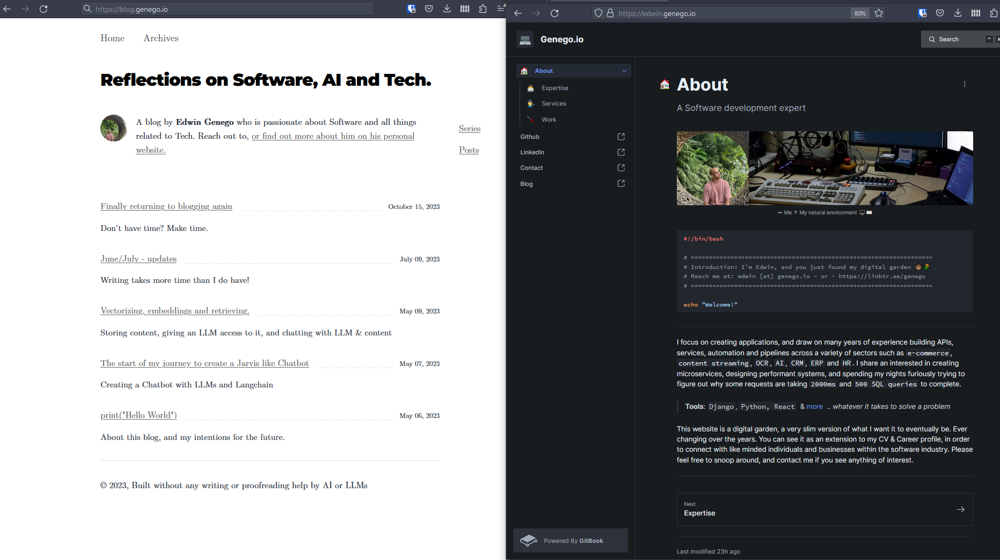

Glaring over this blog, and then staring back at my [website](https://edwin.genego.io/). I feel like there is a
disconnect. They are two different web properties, on two different hosts. I do like them both; and have spent many
hours revising the content. However, after having build so many websites for others, I feel like it's finally
time to build my own. My tools of choice will for simplicity be: [WagtailCMS](https://wagtail.org/), sprinkled with some
VanillaJS, CSS (SASS) & HTMX. You can follow the redesign over at [Github](https://github.com/genego-io/garden). I will
decide at a later point whether I will host it at genego.io or somewhere else. While I am proud of my last name, I was
hoping to find something more suiting. 

Features which I have in mind:

1. **Blogging**: Tagging, Series, Categories, etc. 
   - Also means I need to port all my work from here to the new blog, since its not much, shouldn't be hard.
2. **Portfolio**: Showcase, Projects, etc.
3. **About**: Similar as what we now have on https://edwin.genego.io/
4. **Contact**: A simple contact form, with a map of my location.
5. **Services**: A page describing how I can help others.
6. **Newsletter**: A simple newsletter, which I will use to share my latest blog posts.
7. **Invoicing System**: Coupled with my current system, I am going to consume the API and create my own frontend.

